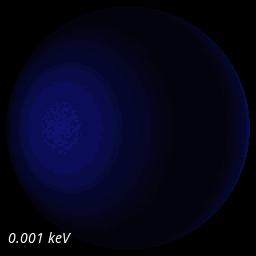

# NeutronStars

End-to-end spectral image cube pipeline for neutron stars, built from first-principles physics in Julia.

## Goal

Compute `I(x, y, ν)` — specific intensity as a function of image-plane position and frequency — from the Schrödinger equation to the final pixel. Every equation traces to a locally-stored published paper. Every approximation is named and recorded.

## Pipeline

1. **Neutron star structure** — TOV solver with BSk EOS analytical fits (Potekhin+ 2013)
2. **Opacities** — Free-free (magnetic and non-magnetic), Thomson scattering, dielectric tensor normal modes (Potekhin & Chabrier 2003)
3. **Atmosphere RT** — Feautrier solver with Rybicki temperature correction, two-mode magnetic extension (Haakonsen+ 2012, Suleimanov+ 2009)
4. **Surface model** — Dipole magnetic field geometry, Greenstein-Hartke temperature map
5. **GR ray tracing** — Schwarzschild geodesics via elliptic integrals (Pechenick+ 1983, Beloborodov 2002)
6. **Rendering** — CIE 1931 colorimetry, sRGB, Reinhard tone mapping

## Spectral Sweep

Neutron star imaged across the electromagnetic spectrum — from far infrared (0.001 keV) through soft X-ray to hard X-ray (2.5 keV). Each frame uses real radiative transfer atmosphere spectra, not blackbody approximations.



## Current Status

- **Phase 2** (tracer bullet): Complete — TOV, ray tracer, surface model, colorimetry, spectral image cube with modified blackbody
- **Phase 3a** (non-magnetic atmosphere): Complete — temperature profile matches McPHAC within 1.2%, flux conservation F/σT⁴ = 0.99, frequency-adaptive depth grid (2× faster)
- **Phase 3b** (magnetic atmosphere): Working — B=10¹² converges (F/σT⁴=1.03), B=10¹⁴ converges (F/σT⁴=1.01), spectral hardening and proton cyclotron features verified against Suleimanov+(2009)
- **Phase 3c** (SpectralImageCube v2): Complete — real atmosphere spectra replace modified blackbody, 256×256×50 render in 1.3s

## Quick Start

```bash
julia --project=. -e 'using NeutronStar; println("OK")'

# Run non-magnetic atmosphere solver
julia --project=. -e '
using NeutronStar; using NeutronStar.GauntFactor: load_gaunt_table
gaunt = load_gaunt_table("refs/code/McPHAC/gffgu.dat")
result = solve_atmosphere(1e6, 2e14, gaunt; K=50, M=8, N=200, verbose=true)'
```

## Physics Report

A 30-page [physics report](docs/physics_report.pdf) documents every equation in the pipeline, cross-referenced against the source publications with equation numbers. It also serves as a code review — three discrepancies found (all minor: a misleading comment, an older solar mass constant, and the Gaunt factor table dependency).

## References

- Haakonsen et al. (2012) ApJ 749:52 — McPHAC (verification target)
- Potekhin & Chabrier (2003) ApJ 585:955 — Magnetic free-free opacities
- Suleimanov, Potekhin & Werner (2009) A&A 500:891 — Magnetic atmosphere scheme
- Pechenick, Ftaclas & Cohen (1983) ApJ 274:846 — NS image in Schwarzschild
- Beloborodov (2002) ApJ 566:L85 — Simplified geodesic formulae

## License

GPL-3.0. See [LICENSE](LICENSE).
